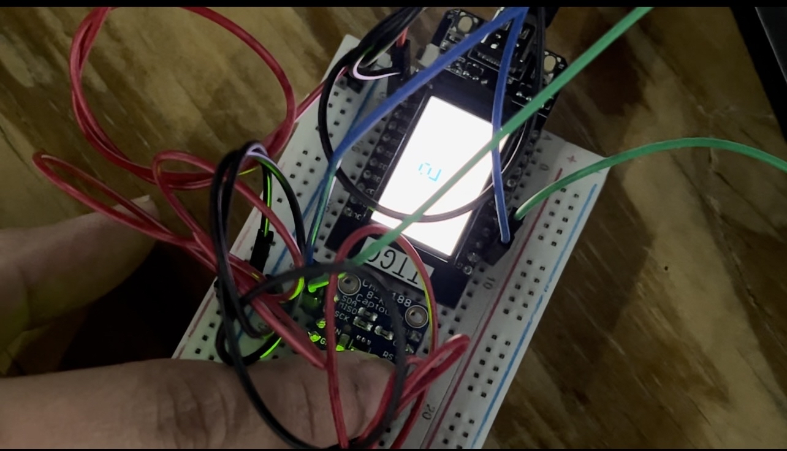
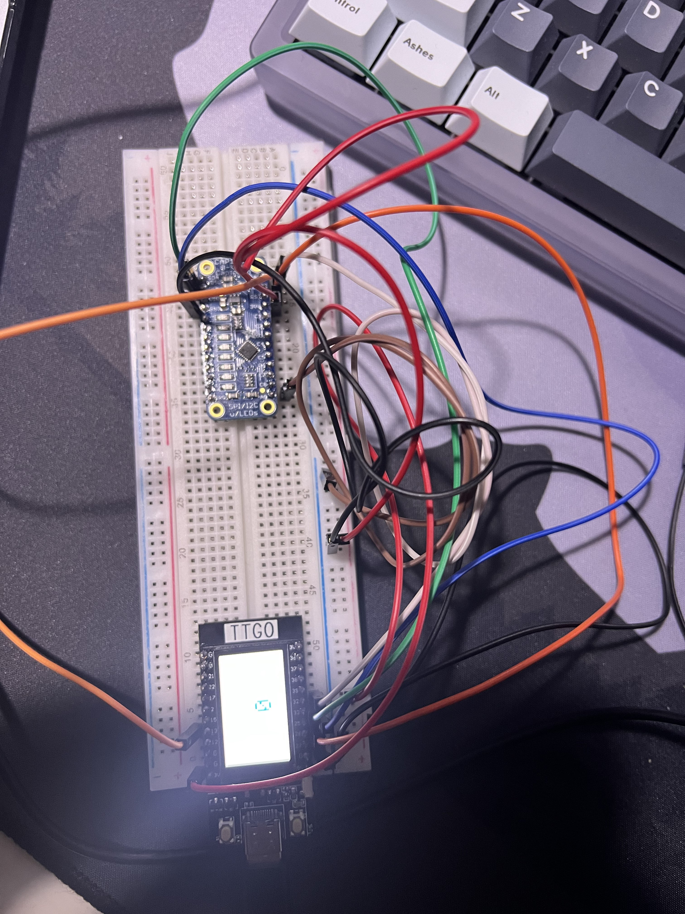
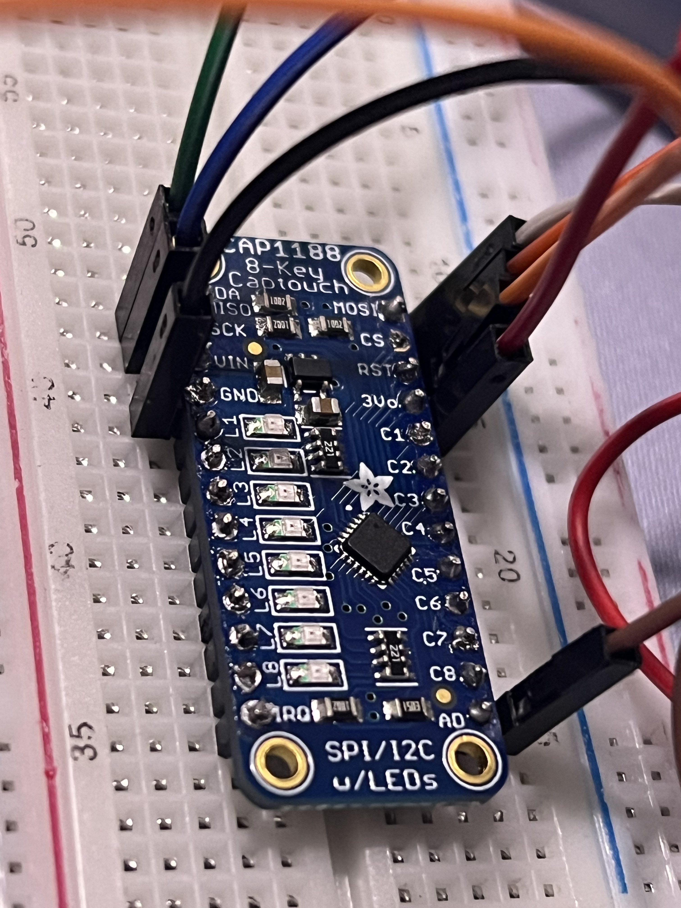

# IoT-Lab1 (by Sophia Canja & Sovial Sonzeu)

## Youtube link to demo videos
part 2: https://www.youtube.com/watch?v=ETBK4KLtHvU&ab_channel=Sovi

part 3: https://www.youtube.com/watch?v=rrI3lGxGRwE&ab_channel=Sovi

## Source files changed are:
main.cpp, platform.ini

## main.cpp file location:
IoT-Lab1/Lab 1/src/main.cpp

## platform.ini file location:
IoT-Lab1/Lab 1/platform.ini

## Image of Part 2 Setup

## Images of Part 3 Setup

